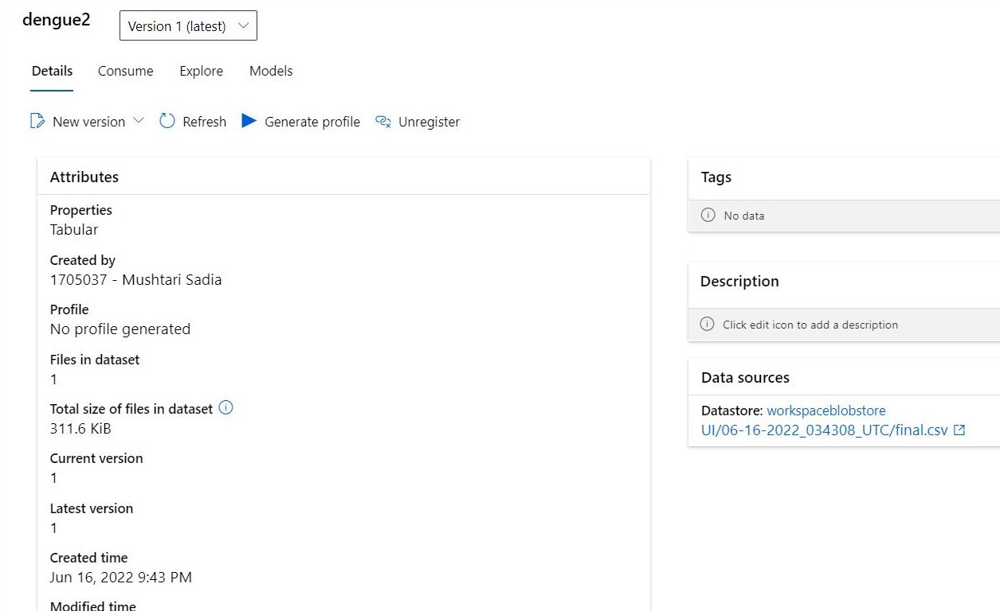
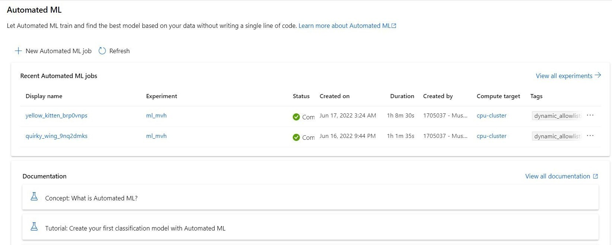
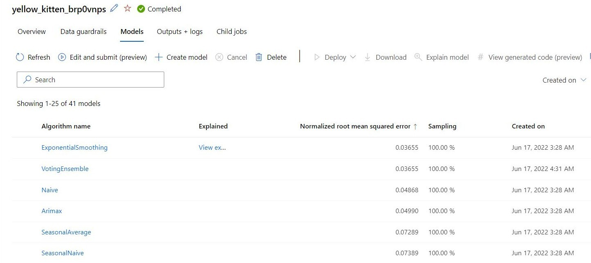
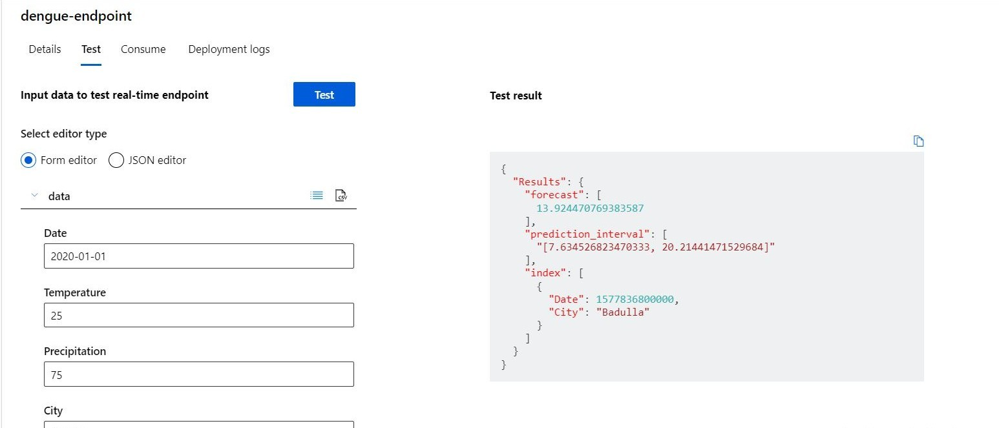
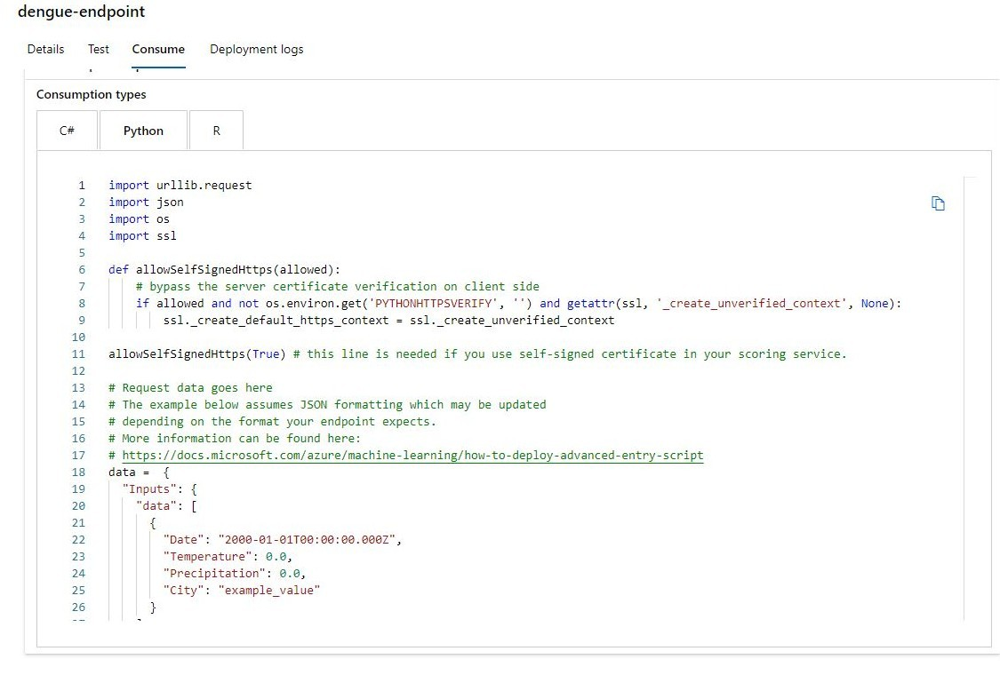
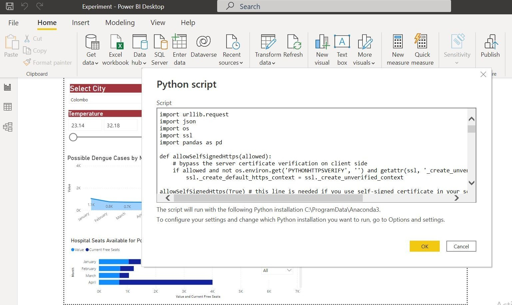

# Predictado: A Dengue Forecasting Dashboard
##  `Introduction`
**Dengue** - an Aedes mosquito borne disease - is one of the most common tropical diseases of the world. It is interesting that inspite of tackling Dengue for hundreds of years, most of the measures to control this disease are reactive and very inefficient. Fortunately, there are many indicators of a Dengue outbreak that can be used for building an effective prediction system. For example, Dengue being a high spreading disease, recent dengue cases are good indicators of possible future cases. Moreover, from years of research, it is now evident that dengue epidemic in any locality has a high correlation with different attributes of weather in that locality. 

Based on these observations, in this project we have built an AI based dengue forecast system that predicts the number of dengue cases in any given region based on the **recent cases** in that region and the **state of different weather parameters**. Apart from these, some other features, such as: A**edes vector population**, **human population**, **infrastructure of an area** are also good indicators of an upcoming Dengue epidemic. We intend to incorporate these features into our model in the future. 

Our application is built on top of a **time series forecasting model**. The front end of the system is an **interactive dashboard** thet presents useful insights about the forecasted dengue cases in the upcoming weeks/months. We developed our application using different Azure Services. The following services were used heavily:
- `Azure Blob Storage`
- `Azure ML Studio`
- `Power BI`

##  `Dataset`

For implementing this project, the required datasets include periodic dengue cases and periodic weather attribute data for different regions of a country.
Since dengue is prevalent in tropical regions, datasets from South-East Asian, Latin American or African countries were preferred for the experiment. 

### `Dataset Sources`

As our reference dataset, we used the Dengue cases and weather attributes of Sri Lanka in 2019-2020.

- Dengue Cases of Sri Lanka : https://www.kaggle.com/datasets/sadaruwan/sri-lanka-dengue-cases-2010-2020

- Temperature, Precipitation Data of Sri Lanka : https://climateknowledgeportal.worldbank.org/download-data

### `Processing The Dataset`

Our target was to use daily data of weather, dengue cases but since such data are publicly less available so we had to process existing dataset on web for training purpose.

Only monthly data of dengue cases was available. We had to upsample the dengue data to convert monthly data to daily data. The data of 26 cities of Sri Lanka were available.

The temperature and precipitation data were also monthly. We also upsampled those data and converted them to daily data. 

The detailed process of upsampling is described in the notebook ‘dataset_processing’.

We combined all the datasets and took the data of 2019 as training dataset. The data of the year 2020 was used for prediction later.

The whole processing of the dataset was done in Jupyter Notebook using pandas library of python.

|Date|Temperature|Precipitation|City|Value|
|---|---|---|---|---|
|2019-01-01 00:00:00|24\.63|26\.51|Colombo|41\.0|
|2019-01-02 00:00:00|25\.95|26\.33|Colombo|40\.0|
|2019-01-03 00:00:00|24\.24|28\.05|Colombo|40\.0|
|2019-01-04 00:00:00|23\.28|28\.7|Colombo|39\.0|
|2019-01-05 00:00:00|23\.02|30\.39|Colombo|39\.0|

## `Creating Azure Workspace`

We set up our Azure account and created a workspace in Azure Machine Learning Studio.

## `Storing The Dataset in Azure Blob Storage`
We uploaded the dataset in Azure Blob Storage and later used the URL of the dataset to access it from anywhere.

## `Azure ML Studio`

We used Azure Machine Learning Studio to build our prediction system.

### `Training ML models on our dataset with Azure ML`

We used the AutoML service of Azure ML studio to train several models on our training dataset. We created an AutoML job and chose time series forecasting models for our prediction. It took about 1.5 hours to complete the ML job. Afterwards, we could see various time series forecasting models trained and sorted on their Normalized Root Mean Square score. We chose the best model which was Exponential Smoothing.

## `Deploying Model as Web Service`

We deployed our model as a web service and later used it as an endpoint to generate prediction on test dataset. Later, we used that test data in Power BI to create our dashboard.

In the following picture, we can see the model can generate a prediction data point based on given input.

We copied the given code in this picture and used it in our 'script.py' to generate predictions on our test dataset.

## `Power BI`
### Using API Endpoint of Model to Predict Dengue Cases for Test Dataset

### `Dashboard`

Finally, we deployed our dashboard in the web using heroku : https://mvh-rmst.herokuapp.com/

